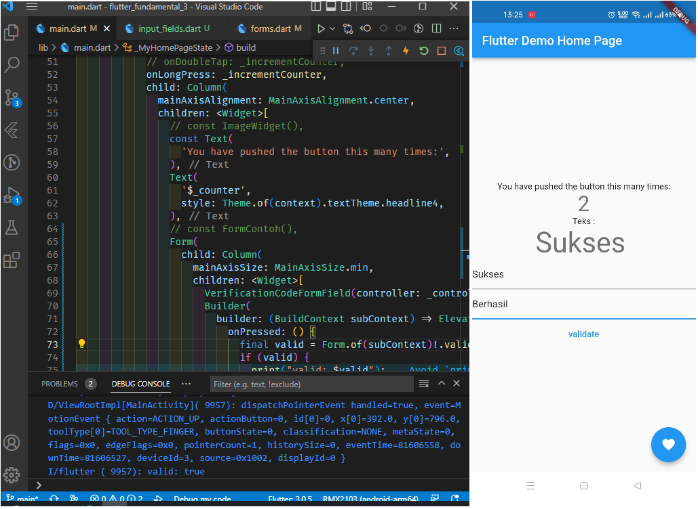
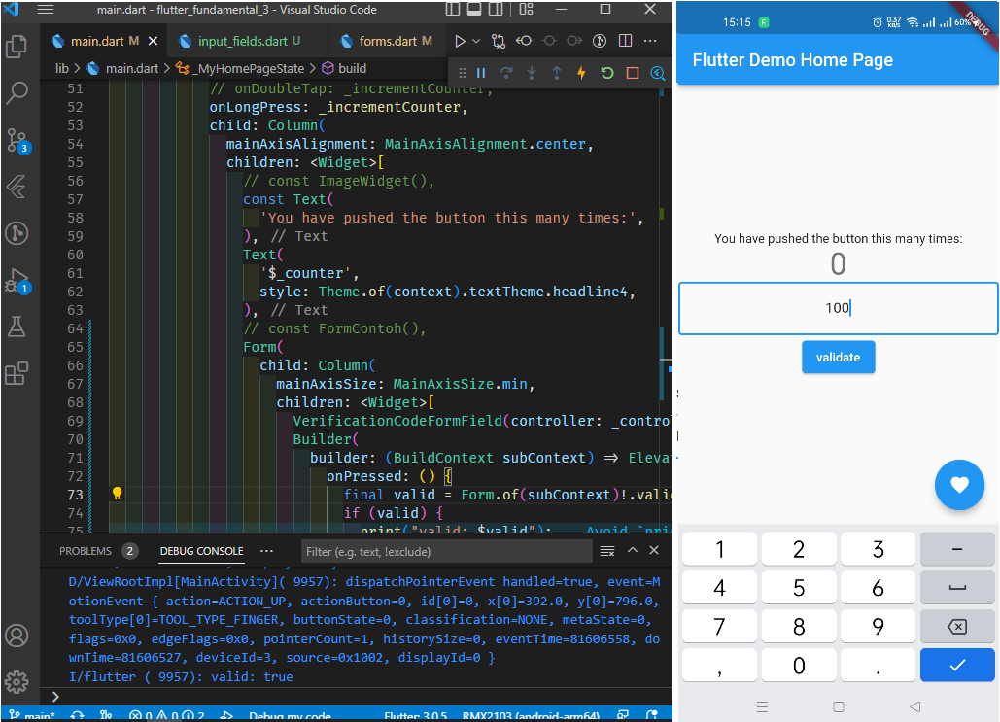

# flutter_fundamental_3
## Praktikum
### OnTap

Fungsi gesture detector akan mendeteksi di Widget mana terjadinya aksi oleh cursor.

Pada gambar di atas, angka akan bertambah jika widget gambar diketuk atau diklik. 
### OnDoubleTap

Pada gambar di atas, angka akan bertambah jika widget gambar dua kali diketuk atau diklik. 
### OnLongPress

Pada gambar di atas, angka akan bertambah jika widget gambar diketuk lama atau diklik panjang. 
### Input Widget

Pada gambar di atas, valid akan bernilai true apabila form tidak kosong. 
### Custom Input Widget

Pada gambar di atas, valid akan bernilai true apabila form berisi angka 0 sampai 9.